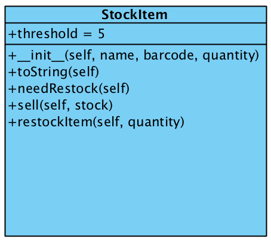
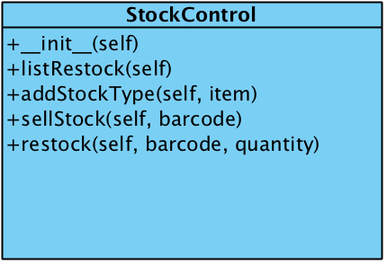
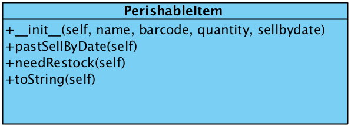

# Stock Control System in Python
 This Project is about the implementation of a stock control system for a small shop. It is developed using the Python programming language. For this project we will be using using python 3. This project will give you a better understanding of how to use Python Classes, Objects, Inheritance, Error handling and later we hope to write some python tests and Qt designs. 

 ## Getting Started
 The project will have a list of stock items, quantity in stock, methods for adding new stock, checking stock levels and selling stock.

#### Introduction
There are 3 main classes in the project:
1.	The StockItem Class
2.	The PerishableStockItem Class
3.	The StockControl Class

###### StockItem Class
This class provides the basic stock item class for the stock control system. In the code it is represented as class StockItem(object):
A stock item is define by the following instance variables
-	name     -- name of product (string)
-	barcode  -- barcode of product item (string)
-	quantity -- number of items in stock (integer)
These are defined in the constructor as :
```python
def __init__(self, name, barcode, quantity):
```
And a class variable: `threshold = 5`, This defines the quantity at which we determine to restock or not to restock a specific stock Item

The StockItem class has the following methods which represent the behaviour operations of a StockItem Object:

<strong>toString method :</strong> The toString returns a string describing the stock item, barcode and the quantity remaining.
```python
def toString(self):
        """Returns a string describing the stock item, its barcode and the quantity remaining"""
        #TODO complete this method
        description = "Stock Name: " + self.name + "\tBarcode: " + self.barcode + \
            "\tQty remaining: " + str(self.quantity)

        return description
```

<strong>needRestock method :</strong> This returns true, a boolean if the item needs restocking (i.e. the quantity<a threshold)
```python
def needRestock(self):
        """Returns true if the item needs restocking (i.e. the quantity<a threshold)"""
        #TODO check if the quantity<threshold and return true if it is
        #we'll set for now the threshold at *five* items
        #so we need to check if self.quantity is less than five.
        threshold = 5
        if self.quantity < threshold:
            return True
        else:
            return False
```

<strong> sell method: </strong> This method processes the sale of an item and raises an exception if an item is sold when its stock is zero).
   ```python
   def sell(self):
      """Processes the sale of an item, generates an exception if an item is sold when its stock is zero"""
      #TODO
      #hint: use the raise method to create an exception.
      if self.quantity < 1:
          raise SoldOutOfStockError(self.name)
      else:
          return 1
   ```

<strong>restockItem method:</strong> This method allows restocking. It takes the quantity of a new stock and it is added to the current quantity of stock. The StockControl class will then call this method from the StockControl restock method. An exception will be raised if the product is not found.

 ```python
 def restock(self, barcode, quantity):
        invalid_barcode = 0
        for item in self.stocklist:
            if barcode == StockItem.getBarcode(item):
                invalid_barcode = 1
                StockItem.restockQuantity(item, quantity) # We set new quantity (current + new)
                print("Item Restocked Successfully: New Qty: ", StockItem.getQuantity(item))
        if invalid_barcode == 0:
            raise ItemNotFoundError(barcode)
 ```



### StockControl Class
The class defines the operations of stock control system
It has the methods to handle the StockItem class and the PerishableStockItem



```python
def __init__(self):
        """The stock control system"""
        # note: we could have implemented the list as a dictionary, with
        # the barcode as the key, however if the barcode for the item
        # changes we might have problems.
        self.stocklist = []  # a list of stock items
 ```
 Diving mor into the methods of the StockControl class
listRestock method: This method returns a string listing the items that need restocking. 
Hint: The '\n' character is used to add a newline after each item.
```python
 def listRestock(self):
        """Return a string listing items that need restocking"""
        # TODO return a list of items that need restocking
        # hint: Need to loop through the stocklist
        # No. 3
        flag = 0
        mystr = ""
        for item in self.stocklist:
            if StockItem.needRestock(item):
                mystr = mystr + StockItem.getName(item) + '\n'
                flag = flag + 1  # item that needs restocking found

        # No. 4
        if flag == 0:
            return "All items stocked"
        else:
            return mystr
  ```
This method returns a message "All items stocked" if all items are stocked 

<strong> addStockType method: </strong> This mehtod is for adding an item to the stock list.
```python
def addStockType(self, item):
        """Add an item to the stock list"""
        self.stocklist.append(item)
  ```
<strong> sellStock method: </strong> This method is initiated to process the sale of an item. it takes the barcode of the item sold, so there is need to search for the item in the list of items. If it's not found an exception needs to be raised.
```python
 def sellStock(self, barcode):
        """Processes the sale of one item"""
        # TODO
        # hint: Look through the list of items
        # and call the 'sell' method of the relevant item
        # return an error if the product isn't found
        # No. 7
        invalid_barcode = 0
        for item in self.stocklist:
            if barcode == StockItem.getBarcode(item):
                invalid_barcode = 1
                if StockItem.sell(item) == 1:
                    # StockItem.setQuantity(StockItem, 0) find away of reducing the stock quantity
                    newQty = StockItem.getQuantity(item) - 1  # We reduce stock by one per item solid
                    StockItem.setQuantity(item, newQty)
                    print("Sold: Successfully: Qty remaining: ", StockItem.getQuantity(item))
                else:
                    raise SoldOutOfStockError()
        if invalid_barcode == 0:
            raise ItemNotFoundError(barcode)
  ```
Barcode of the item being restocked and the quantity. i.e. its definition looks like: `restock(self, barcode, quantity)`

 ```python
 def restock(self, barcode, quantity):
        invalid_barcode = 0
        for item in self.stocklist:
            if barcode == StockItem.getBarcode(item):
                invalid_barcode = 1
                StockItem.restockQuantity(item, quantity) # We set new quantity (current + new)
                print("Item Restocked Successfully: New Qty: ", StockItem.getQuantity(item))
        if invalid_barcode == 0:
            raise ItemNotFoundError(barcode)
 ```

### PerishableItem Class
Items that can go off quickly like sugar are defined in this class. It is a sub class of StockItem Class represented as  `class PerishableStockItem(StockItem): `For this type of product,an assumption will be made that all of the current stock is of the same date, so a new instance variable sellbydate will be created.

For this class we will make a constructor with the last parameter the sellbydate: def init(self, name, barcode, quantity, sellbydate): Reminder you can call the parent constructor with the super method, e.g. super(PerishableStockItem,self).init(name, barcode, quantity)
```python
def __init__(self, name, barcode, quantity, sellbydate):
        super(PerishableStockItem, self).__init__(name, barcode, quantity)
        self.sellbydate = sellbydate
        self.name = name
        self.barcode = barcode
        self.quantity = quantity
```

Like most subclasses, the PerishableItem class can have its own methods, override StockItem class methods or simply use the existing behaviour definitions in the StockItem class.


<strong> pastSellByDate method:</strong> Checks if we're past the sellbydate (returns true if we are) We will be using the date type to test forexample if today is AFTER the sellbydate, so we simply compare: date.today()>self.sellbydate (where date has been imported from the datetime module)
```python
def pastSellByDate(self):
        if date.today() > self.sellbydate:
            return True
```
<strong>needRestock method:</strong>Here, we override the needRestock method of the StockItem to also check if it's past the sellbydate, and return true if either it's out of stock or out of date.
```python
# Override needRestock
    def needRestock(self):
        """Returns true if this item needs restocking (i.e. the quantity<a threshold)"""
        # TODO check if the quantity<threshold and return true if it is
        # we'll set for now the threshold at *five* items
        # so we need to check if self.quantity is less than five.

        threshold = 5
        if self.quantity < threshold or PerishableStockItem.pastSellByDate(self):
            return True
        else:
            return False
```
<strong>toString method:</strong> We override the toString method of the StockItem class to display the sell by date. With this, we can get the original string using the super method: message = super(PerishableStockItem,self).toString() then use the str() method to get the date as a string: message += " " + str(self.sellbydate)

```python
# Qverride the toString to display sellbydate.
    def toString(self):
        """Returns a string describing the stock item, its barcode and the quantity remaining"""
        # TODO complete this method
        # No. 1
        description = "Stock Name: " + self.name + "\tBarcode: " + self.barcode + \
            "\tQty remaining: " + str(self.quantity) + "\tSell by: " + str(self.sellbydate)

        return description
```
Exception Handling

 Base class for exceptions in this module.
```python
class StockControlSystemError(Exception):

```
Exception raised when an item is sold that isn't in stock
```python
class SoldOutOfStockError(StockControlSystemError):
     def __init__(self, item): #item -- item being sold
        self.item = item
```
Exception raised when an item is sold that isn't in the stock list
```python
class ItemNotFoundError(StockControlSystemError):
    def __init__(self, barcode): # barcode -- barcode of item being sold
        self.barcode = barcode
 ```
### Useful Links

 Python Error Handling <br/>
- [Errors and Exceptions](https://docs.python.org/3/tutorial/errors.html)
-  [Writing and Using Custom Exceptions in Python](https://www.codementor.io/sheena/how-to-write-python-custom-exceptions-du107ufv9)
-  [Python Exceptions: An Introduction](https://realpython.com/python-exceptions/)
-  [Exception Handling in Python](https://www.pythonforbeginners.com/error-handling/exception-handling-in-python)
 - [Python Custom Exceptions](https://www.programiz.com/python-programming/user-defined-exception)
 - [The definitive guide to Python exceptions](https://julien.danjou.info/python-exceptions-guide/)
 - [Python - Exceptions Handling](https://www.tutorialspoint.com/python/python_exceptions.htm)
 - [Raising Exceptions](https://www.linuxtopia.org/online_books/programming_books/python_programming/python_ch17s03.html)
 - [How to use “raise” keyword in Python](https://stackoverflow.com/questions/13957829/how-to-use-raise-keyword-in-python)

 Writing Python Tests <br/>
 - [Testing Your Code](https://docs.python-guide.org/writing/tests/)
 - [Running & Writing Tests](https://devguide.python.org/runtests/)
 - [Understanding Unit Testing](https://jeffknupp.com/blog/2013/12/09/improve-your-python-understanding-unit-testing/)
 - [How to Write Python Unit Tests](https://www.agnosticdev.com/content/how-write-python-unit-tests)
 - [A simple introduction to Test Driven Development with Python](https://medium.freecodecamp.org/learning-to-test-with-python-997ace2d8abe)

Python Lists <br/>
- [Data Structures](https://docs.python.org/3/tutorial/datastructures.html)
- [Python Lists](https://developers.google.com/edu/python/lists)
- [Python - Lists](https://www.tutorialspoint.com/python/python_lists.htm)
- [Understanding Lists in Python 3](https://www.digitalocean.com/community/tutorials/understanding-lists-in-python-3)
- [Python List](https://www.programiz.com/python-programming/list)
- [An Introduction to Python Lists](http://effbot.org/zone/python-list.htm)
- [Python lists](http://zetcode.com/lang/python/lists/)
- [Lists](http://thomas-cokelaer.info/tutorials/python/lists.html)

Object Oriented Programming in Python<br/>
- [Python inheritance and polymorphism](https://thepythonguru.com/python-inheritance-and-polymorphism/)
- [Working with the Python Super Function](https://www.pythonforbeginners.com/super/working-python-super-function)
- [Understanding Class Inheritance in Python 3](https://www.digitalocean.com/community/tutorials/understanding-class-inheritance-in-python-3)
-[Object-oriented programming](https://python-textbok.readthedocs.io/en/1.0/Object_Oriented_Programming.html)
- [Multiple Inheritance Minefield](http://amyboyle.ninja/Python-Inheritance)
